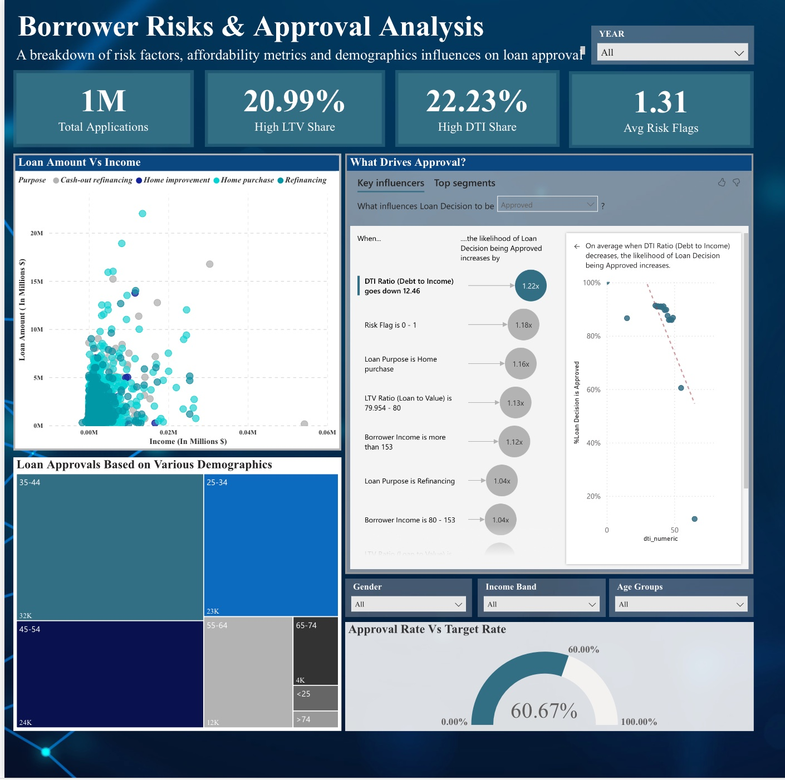

# Borrower Behavior & Loan Approval Analytics
### A Data-Driven Exploration of Lending Patterns and Borrower Outcomes in Massachusetts

## Overview

This project analyzes Massachusetts Home Mortgage Disclosure Act (HMDA) data to uncover the factors that drive loan approvals and denials. The end-to-end pipeline covers data ingestion, preprocessing, feature engineering, and a three-page interactive Power BI dashboard, structured around a central question: *if borrowers like Maya are denied despite decent income, what really drives loan decisions in Massachusetts?*

The analysis spans 2020 to 2024 MA mortgage data (focused on 2023 for the cleaned model dataset) and is presented as a 16-slide narrative deck supported by live Power BI visuals.

---

## Repository Contents

| File | Description |
|------|-------------|
| `Borrower_Analytics_Preprocessing_.ipynb` | Full preprocessing pipeline: loading, filtering, decoding, feature engineering, and final CSV export |
| `PowerBI_Sample_ppt.pdf` / `PowerBI_Sample_ppt.pptx` | 16-slide presentation deck embedding live Power BI dashboard pages |

---

## Data Source

**HMDA (Home Mortgage Disclosure Act)** public dataset, Massachusetts subset.

Source file: `loan_purposes_31_state_MA.csv`
Coverage: 2020 to 2024, filtered to `activity_year = 2023` and `state_code = MA` for the final model dataset.

---

## Preprocessing Pipeline

The notebook runs in four stages, producing a clean analytics-ready CSV.

**Stage 1: Load and Filter**
Load the raw HMDA file, filter to MA 2023 records, validate state and year columns, and run a sanity check on key fields.

**Stage 2: Column Selection**
Trim to 18 core fields covering loan characteristics, borrower economics, geographic identifiers, and outcomes.

**Stage 3: Label Decoding**
Map numeric HMDA codes to human-readable labels:

- `loan_type` (1–4): Conventional, FHA-insured, VA-guaranteed, USDA
- `loan_purpose` (1, 2, 31, 32, 4, 5): Home Purchase, Home Improvement, Refinancing, Cash-out Refinancing, Other, Not Applicable
- `action_taken` (1–8): full label map plus a rolled-up `action_taken_category` (Approved / Denied / Withdrawn / Purchased)
- `county_code` (FIPS): all 14 Massachusetts county names (Barnstable through Worcester)

**Stage 4: Feature Engineering**
New derived columns for dashboard-readiness:

- `income_bucket`: four tiers (< 50k, 50k–<100k, 100k–<150k, 150k+)
- `loan_amount_bucket`: four tiers (< 200k, 200k–<400k, 400k–<600k, 600k+)
- `dti_numeric` and `dti_bucket`: parsed from HMDA's mixed-format DTI strings (numeric, percentage ranges, or exempt/not-available flags)
- `high_ltv_flag`: LTV >= 80
- `high_dti_flag`: DTI >= 43
- `fha_flag`: loan type is FHA-insured
- `low_income_flag`: income < $50k
- `risk_flags_count`: sum of the four risk flags per record (0–4)

**Final Output:** `MA_2023_HMDA_ALL_PAGES_FINAL.csv` (28 columns)

---

## Power BI Dashboard

The dashboard is structured across three pages, each corresponding to a narrative act in the presentation.

### Page 1: Massachusetts Lending Overview (Path to Lending)

KPI cards: 1M total applications, $399k avg loan amount, $750k avg property value, 18% cash-out share.

Visuals:
- Average Loan by Purpose (grouped bar, year-over-year)
- Loan Types Over Time (100% stacked bar, 2020–2024)
- Applications by County (filled map of MA)
- Lending Trends by Purpose (line chart, 2020–2024)

Filters: Loan Type, Loan Purpose, Activity Year (toggle buttons: 2020–2024)

Key insight callouts (speech bubbles): conventional loans dominate at 85%+; Middlesex and Suffolk counties lead in volume; 2021 refinancing boom of 200K+ applications.

### Page 2: Borrower Risks and Approval Analysis (Path to Approval)



KPI cards: 1M total applications, 20.99% high LTV share, 22.23% high DTI share, 1.31 avg risk flags.

Visuals:
- Loan Amount vs Income scatter (colored by loan purpose, 2020–2024 filter)
- What Drives Approval? (Power BI Key Influencers visual)
- Loan Approvals Based on Various Demographics (treemap by age group)
- Approval Rate vs Target Rate (gauge: 60.67%)

Filters: Year, Gender, Income Band, Age Groups

Key insight callouts: home purchases cluster high on loan amount regardless of income; ages 35–44 consistently lead approvals; approval rate fell from 65.69% (2020) to 54.95% (2023).

### Page 3: HMDA Lending Analysis — Risk and Denial Insights (Path to Denial)

Subtitle: *Exploring denial patterns, borrower risk indicators, and factors influencing loan approvals across Massachusetts (2020–2024)*

Visuals:
- Denial Rate Across Loan Purposes (bar chart; home improvement highest at ~29%)
- Approval vs Denial Patterns Across Income Bands (stacked bar by income group)
- Reasons for Loan Denial (donut chart; debt-to-income ratio leads at 42.96% of denials, ~54,327 records)
- Drivers Behind Loan Denial (decomposition tree: risk flag count and denial reason)

Filters: Year, County Code, Ethnicity

---

## Key Findings

**Lending Landscape**
- ~1M total applications across 5 years in Massachusetts
- Conventional loans make up 85%+ of volume; FHA and VA serve niche segments
- Middlesex and Suffolk counties dominate geographically (Boston metro concentration)
- 2021 saw a refinancing boom of 200K+ applications driven by historically low rates

**Approval Drivers**
- Approval rate declined from 65.69% in 2020 to 54.95% in 2023 as interest rates rose
- Top factors in order of impact: low DTI (1.22x boost), low risk flag count (1.18x), home purchase purpose over refinancing (1.16x), LTV in the 79–80% range (1.13x)
- DTI below 43% is the single strongest predictor of loan success; model explains 66% of variance
- Ages 35–44 lead approvals across all years; the 25–34 cohort is closing the gap

**Denial Patterns**
- Overall denial rate stable at ~11% across all four years
- Low-income applicants (under $50k) face ~60% denial rates vs ~14% for higher earners
- Home improvement loans carry the highest denial rate (~29%)
- Debt-to-income ratio accounts for ~43% of all denial reasons; credit history is second

---

## Recommendations

**For Lenders:** develop alternative home improvement loan products; introduce DTI counseling and pre-qualification programs.

**For Policy:** fund financial literacy programs targeting borrowers earning under $50k; expand first-time buyer assistance.

**For Borrowers:** target a 20%+ down payment to manage LTV; build credit score above 680 before applying.

**Future Research:** deeper demographic disparity analysis; predictive approval modeling.

---

## Requirements

```
pandas
numpy
```

Run in Google Colab or any Python 3.8+ environment with the source CSV at the path specified in the notebook. The Power BI dashboard connects to the exported CSV as a live data source.

---

## Output Schema

The final CSV (`MA_2023_HMDA_ALL_PAGES_FINAL.csv`) contains 28 columns:

| Column | Type | Description |
|--------|------|-------------|
| `activity_year` | int | Reporting year (2023) |
| `state_code` | str | State abbreviation (MA) |
| `county_code` | Int64 | FIPS county code |
| `county_name` | str | Mapped county name |
| `census_tract` | str | Census tract identifier |
| `loan_type` | int | Raw loan type code |
| `loan_type_label` | str | Decoded loan type |
| `loan_purpose` | int | Raw purpose code |
| `loan_purpose_label` | str | Decoded loan purpose |
| `loan_amount` | float | Loan amount in dollars |
| `loan_amount_bucket` | str | Loan size tier |
| `loan_to_value_ratio` | float | LTV ratio |
| `interest_rate` | float | Interest rate |
| `rate_spread` | float | Rate spread |
| `property_value` | float | Appraised property value |
| `income` | str | Applicant income (raw HMDA) |
| `income_numeric` | float | Parsed numeric income |
| `income_bucket` | str | Income tier |
| `debt_to_income_ratio` | str | DTI (raw HMDA string) |
| `dti_numeric` | float | Parsed numeric DTI |
| `dti_bucket` | str | DTI tier |
| `applicant_age` | str | Age band |
| `derived_dwelling_category` | str | Property type |
| `conforming_loan_limit` | str | Conforming or jumbo flag |
| `action_taken` | int | Raw outcome code |
| `action_taken_label` | str | Decoded outcome |
| `action_taken_category` | str | Rolled-up outcome (Approved / Denied / Withdrawn / Purchased) |
| `high_ltv_flag` | bool | LTV >= 80 |
| `high_dti_flag` | bool | DTI >= 43 |
| `fha_flag` | bool | FHA loan |
| `low_income_flag` | bool | Income < $50k |
| `risk_flags_count` | int | Number of risk flags triggered (0–4) |
